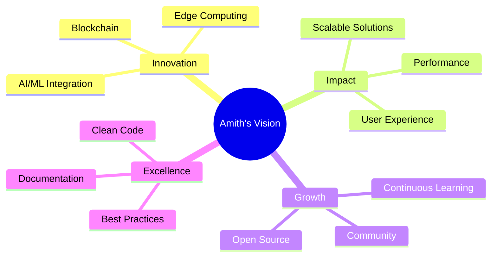

<div align="center">

<!-- HEADER -->


<!-- ANIMATED TYPING -->
<p align="center">
  
</p>

<!-- PROFILE VIEWS & FOLLOWERS -->
<p align="center">
  
  
  
</p>

</div>

---

<br>

## 🎭 About Me


```javascript
const amithProfile = {
    name: "Sayed Mirchoni",
    role: "Software Engineer",
    location: "🇮🇳 India",
    education: "B.E in Computer Science",
    
    passions: {
        coding: ["Web Development", "System Design", "Cloud Architecture"],
        interests: ["AI/ML", "Blockchain", "Open Source"],
        hobbies: ["Reading Tech Blogs", "Building Side Projects"]
    },
    
    currentFocus: {
        learning: "Advanced Kubernetes & Service Mesh",
        building: "Scalable Microservices Platform",
        exploring: "Edge Computing & Serverless",
        improving: "System Design & Architecture Skills"
    },
    
    lifePhilosophy: "Code with purpose, build with passion! 🚀",
    
    availability: "Open to interesting projects & collaborations"
};

console.log("Let's build something amazing together! 💻✨");
```

<br clear="right"/>

---

<br>

## 🎯 Core Competencies

<table align="center" width="100%">
<tr>
<td width="50%" valign="top">

### 🎨 Frontend Development
- ⚛️ **React.js & Next.js** - Building modern SPAs
- 🎭 **TypeScript** - Type-safe development
- 🎨 **Tailwind CSS** - Rapid UI development
- 📱 **Responsive Design** - Mobile-first approach
- ⚡ **Performance Optimization** - Core Web Vitals
- 🎪 **State Management** - Redux, Zustand, Context

</td>
<td width="50%" valign="top">

### ⚙️ Backend Development
- 🟢 **Node.js & Express** - REST APIs
- 🐍 **Python** - Data processing & automation
- ☕ **Java** - Enterprise applications
- 🗄️ **Database Design** - SQL & NoSQL
- 🔐 **Authentication** - JWT, OAuth, SSO
- 🚀 **API Development** - GraphQL & REST

</td>
</tr>
<tr>
<td width="50%" valign="top">

### ☁️ Cloud & DevOps
- ☁️ **AWS Services** - EC2, S3, Lambda, RDS
- 🐳 **Docker** - Containerization expert
- ☸️ **Kubernetes** - Orchestration & deployment
- 🔄 **CI/CD** - GitHub Actions, Jenkins
- 📊 **Monitoring** - Prometheus, Grafana
- 🛡️ **Security** - Best practices & compliance

</td>
<td width="50%" valign="top">

### 🧩 Additional Skills
- 🏗️ **System Design** - Scalable architectures
- 🧪 **Testing** - Unit, Integration, E2E
- 📈 **Agile/Scrum** - Team collaboration
- 🎯 **Problem Solving** - DSA & algorithms
- 📝 **Documentation** - Technical writing
- 🤝 **Mentoring** - Knowledge sharing

</td>
</tr>
</table>

---

<br>

## 🛠️ Technology Stack

<div align="center">

### 💻 Languages


### 🎨 Frontend Technologies


### ⚙️ Backend Technologies


### 🗄️ Databases


### ☁️ Cloud & DevOps


### 🧪 Testing & Tools


</div>

---

<br>

## 📊 GitHub Statistics

<div align="center">
  
  
</div>

<div align="center">
  
  
</div>

<br>

<!-- TROPHIES -->
<div align="center">
  
</div>

---

<br>

## 🚀 Featured Projects

<div align="center">

<table>
<tr>
<td width="50%">
<h3 align="center">🎯 Project Alpha</h3>
<div align="center">
<a href="https://github.com/amithsulakhe/project-alpha" target="_blank">

</a>
<p>
<a href="https://github.com/amithsulakhe/project-alpha" target="_blank">

</a>
<a href="https://demo-alpha.com" target="_blank">

</a>
</p>
<p><strong>React, Node.js, MongoDB</strong> - Full-stack e-commerce platform with real-time inventory management</p>
</div>
</td>

<td width="50%">
<h3 align="center">🌟 Project Beta</h3>
<div align="center">
<a href="https://github.com/amithsulakhe/project-beta" target="_blank">

</a>
<p>
<a href="https://github.com/amithsulakhe/project-beta" target="_blank">

</a>
<a href="https://demo-beta.com" target="_blank">

</a>
</p>
<p><strong>Next.js, TypeScript, PostgreSQL</strong> - AI-powered task management system with smart scheduling</p>
</div>
</td>
</tr>

<tr>
<td width="50%">
<h3 align="center">🔥 Project Gamma</h3>
<div align="center">
<a href="https://github.com/amithsulakhe/project-gamma" target="_blank">

</a>
<p>
<a href="https://github.com/amithsulakhe/project-gamma" target="_blank">

</a>
<a href="https://demo-gamma.com" target="_blank">

</a>
</p>
<p><strong>Python, FastAPI, Docker</strong> - Microservices-based analytics platform with real-time dashboards</p>
</div>
</td>

<td width="50%">
<h3 align="center">⚡ Project Delta</h3>
<div align="center">
<a href="https://github.com/amithsulakhe/project-delta" target="_blank">

</a>
<p>
<a href="https://github.com/amithsulakhe/project-delta" target="_blank">

</a>
<a href="https://demo-delta.com" target="_blank">

</a>
</p>
<p><strong>Kubernetes, AWS, Terraform</strong> - Cloud-native CI/CD pipeline with automated deployments</p>
</div>
</td>
</tr>
</table>

</div>

---

<br>

## 🌟 What Drives Me

<div align="center">


</div>

<br>

<table align="center">
<tr>
<td width="33%" align="center">

### 💡 Innovation
Building cutting-edge solutions that push technological boundaries and solve real-world problems

</td>
<td width="33%" align="center">

### 🎯 Impact
Creating scalable systems that make a difference in people's lives and businesses

</td>
<td width="33%" align="center">

### 🚀 Growth
Constantly learning, sharing knowledge, and contributing to the developer community

</td>
</tr>
</table>

---

<br>

## 📚 Latest Blog Posts

<!-- BLOG-POST-LIST:START -->
- 🚀 [Building Scalable Microservices with Kubernetes](https://blog.amithsulakhe.dev/kubernetes-microservices)
- ⚡ [Optimizing React Performance: Tips and Tricks](https://blog.amithsulakhe.dev/react-performance)
- 🔐 [Implementing Zero-Trust Security in Cloud Applications](https://blog.amithsulakhe.dev/zero-trust-security)
- 🎨 [Modern Frontend Architecture Patterns](https://blog.amithsulakhe.dev/frontend-architecture)
<!-- BLOG-POST-LIST:END -->

➡️ [More blog posts...](https://blog.amithsulakhe.dev)

---

<br>

## 🏆 Achievements & Certifications

<div align="center">

| 🎖️ Certification | 🏢 Provider | 📅 Year |
|------------------|-------------|---------|
| AWS Certified Solutions Architect | Amazon Web Services | 2024 |
| Certified Kubernetes Administrator | CNCF | 2024 |
| Google Cloud Professional Architect | Google Cloud | 2023 |
| Microsoft Azure Developer Associate | Microsoft | 2023 |

</div>

---

<br>

## 🤝 Let's Collaborate

<div align="center">

<table>
<tr>
<td align="center" width="25%">
<a href="https://linkedin.com/in/amithsulakhe" target="_blank">

</a>
<br>
<strong>Professional Network</strong>
</td>

<td align="center" width="25%">
<a href="https://twitter.com/amithsulakhe" target="_blank">

</a>
<br>
<strong>Tech Updates</strong>
</td>

<td align="center" width="25%">
<a href="mailto:amith.sulakhe@example.com">

</a>
<br>
<strong>Direct Contact</strong>
</td>

<td align="center" width="25%">
<a href="https://amithsulakhe.dev" target="_blank">

</a>
<br>
<strong>My Work</strong>
</td>
</tr>
</table>

<br>

### 💬 Let's Build Something Amazing Together!

<p>
I'm always open to interesting conversations and collaboration opportunities.
<br>
Whether it's a challenging project, open-source contribution, or just a tech chat - let's connect!
</p>

</div>

---

<br>

## 💭 Coding Philosophy

<div align="center">

> *"First, solve the problem. Then, write the code."* - John Johnson

> *"Any fool can write code that a computer can understand. Good programmers write code that humans can understand."* - Martin Fowler

> *"The best error message is the one that never shows up."* - Thomas Fuchs

</div>

---

<br>

## 📈 Weekly Development Breakdown

<!--START_SECTION:waka-->
```text
TypeScript   12 hrs 30 mins  ████████████░░░░░░░░░  45.2%
JavaScript   8 hrs 15 mins   ████████░░░░░░░░░░░░░  29.8%
Python       4 hrs 10 mins   ████░░░░░░░░░░░░░░░░░  15.1%
Docker       1 hr 45 mins    █▓░░░░░░░░░░░░░░░░░░░   6.3%
YAML         1 hr 5 mins     █░░░░░░░░░░░░░░░░░░░░   3.6%
```
<!--END_SECTION:waka-->

---

<br>

<div align="center">

### 🎮 When I'm Not Coding...

🎸 Playing Guitar | 📚 Reading Tech Books | 🏃 Running | ☕ Coffee Enthusiast | 🎮 Gaming

</div>

---

<br>

## 🌈 Random Dev Wisdom

<div align="center">


</div>

---

<br>

<div align="center">

### 🐍 Contribution Snake


</div>

---

<br>

<!-- FOOTER -->
<div align="center">


### ⚡ "Code is not just about solving problems, it's about crafting elegant solutions" ⚡

<p>


</p>

**Thank you for visiting! Let's connect and create something extraordinary together! 🚀**

<p>
<a href="#"></a>
</p>

---

<sub>Last Updated: Automatically via GitHub Actions ⚡</sub>

</div>
